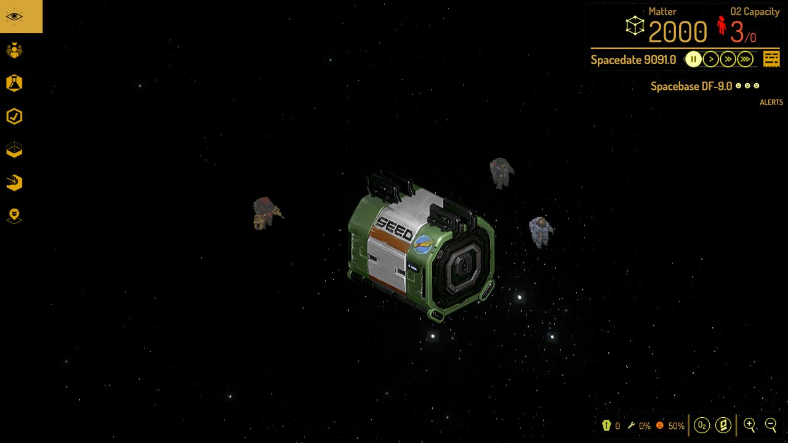

# Spacebase DF-9 — Browser Recreation

An independent, graphics-first browser recreation of **Spacebase DF-9**, built
with TypeScript, Three.js, and Vite. The project aims to preserve the original
game's mechanics, interface, proportions, graphics, and behavior, using the
published Lua source as its behavioral reference.

> **Ownership requirement:** you must legally own or otherwise be licensed to
> use Spacebase DF-9 before opening the hosted game. The public version presents
> this attestation before the playable game asset library loads.

[](https://wan0.net/df9/)

## Play

Visit the project site at <https://wan0.net/df9/> and choose **Open the game**.
Acceptance of the player terms is stored only in your browser.

## Status

- Original isometric base construction, rooms, zones, objects, and cutaway view
- Character needs, jobs, utility AI, combat, disease, research, and events
- Original game-derived interface, environment, character, audio, and VFX assets
- Save/load, goals, tutorials, overlays, spatial audio, and debug-free production builds
- 95 unit tests and 293 browser tests at the publication baseline
- Production build deployable beneath the GitHub Pages `/df9/` project path

This is a playable public beta, not a claim that every undocumented original
edge case has been reproduced.

## Local development

```bash
npm ci
npm run dev
```

Open `http://localhost:5173/game.html` for the game. Validation:

```bash
npm run verify:public
npm run typecheck
npm run build
npm run test:coverage
npm run test:e2e
npm run build:pages
```

## Repository layout

```text
src/       game engine, simulation, renderers, UI, audio, and public shell
public/    browser-ready runtime assets and `.nojekyll`
e2e/       Playwright browser regression suite
tests/     Vitest unit and system tests
scripts/   verification and CI helpers
docs/      architecture, controls, and testing notes
```

The original game installation, local extraction inputs, and Lua reference
checkout are ignored and must not be published.

## Reference and provenance

The primary behavioral reference is the community-maintained
[Spacebase DF-9 source](https://github.com/ShadowApex/SpaceBase-DF9), published
under CPAL-1.0. It is used to understand observable behavior, constants,
state machines, data, and presentation. The local reference checkout is not
included in this repository.

## Licence

Original project code and documentation are licensed under the
[BSD 3-Clause Licence](LICENSE). That licence does **not** apply to Spacebase
DF-9 assets, trademarks, or other third-party material. See
[ASSET-NOTICE.md](ASSET-NOTICE.md) and [LEGAL.md](LEGAL.md).

This project is not affiliated with, endorsed by, or sponsored by Double Fine
Productions or the original game's creators.
